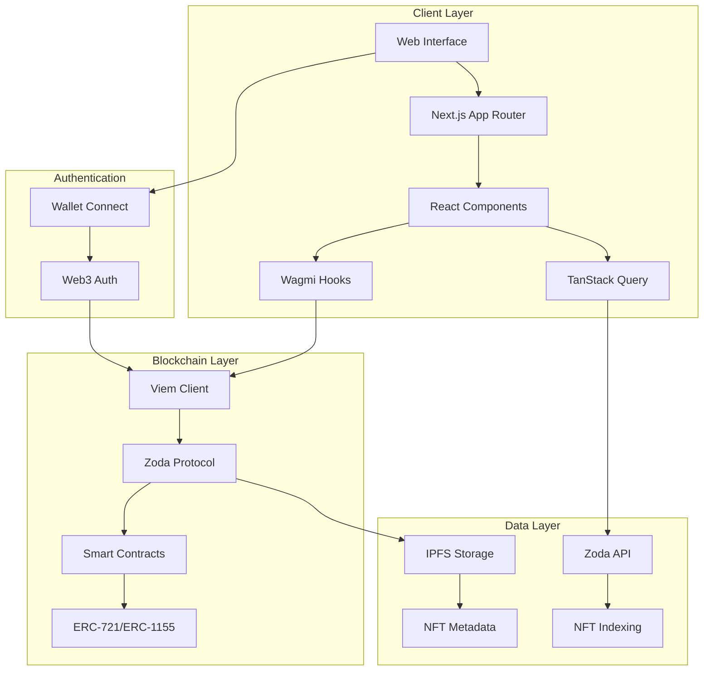

# Zoda

A modern, decentralized NFT marketplace built with Next.js 14, leveraging Zoda Protocol for seamless NFT trading and creation.

## Features

- 🎨 Create and List NFTs
- 💰 Buy and Sell NFTs
- 🔍 Advanced NFT Discovery
- 👛 Wallet Integration
- ⚡ Lightning-fast Performance
- 📱 Responsive Design

## Tech Stack

- **Frontend**: Next.js 14, React, TypeScript
- **Styling**: Tailwind CSS, Shadcn UI, Radix UI
- **Web3**: Viem v2, Wagmi v2
- **Authentication**: Web3 Wallet Connect
- **State Management**: TanStack Query
- **Form Handling**: React Hook Form, Zod
- **Testing**: Vitest, React Testing Library

## Architecture



### Application Flow

```
┌──────────────────┐     ┌───────────────────┐     ┌─────────────────┐
│   Client Layer   │     │  Middleware Layer │     │ Blockchain Layer│
│                  │     │                   │     │                 │
│  ┌────────────┐  │     │   ┌─────────┐     │     │   ┌─────────┐   │
│  │   Next.js  │──┼────►│   │  API    │     │     │   │  Zoda   │   │
│  │ Components │  │     │   │ Routes  │──┐  │     │   │Protocol │   │
│  └────────────┘  │     │   └─────────┘  │  │     │   └────┬────┘   │
│         ▲        │     │        ▲       │  │     │        │        │
│         │        │     │        │       │  │     │        ▼        │
│  ┌────────────┐  │     │   ┌─────────┐  │  │     │   ┌─────────┐   │
│  │   Wagmi    │  │     │   │TanStack │◄─┘  │     │   │  Smart  │   │
│  │   Hooks    │──┼────►│   │ Query   │     │     │   │Contract │   │
│  └────────────┘  │     │   └─────────┘     │     │   └─────────┘   │
│         ▲        │     │                   │     │                 │
│         │        │     │   ┌─────────┐     │     │   ┌─────────┐   │
│  ┌────────────┐  │     │   │  IPFS   │     │     │   │  NFT    │   │
│  │  Wallet    │──┼────►│   │Storage  │     │     │   │Metadata │   │
│  │  Connect   │  │     │   └─────────┘     │     │   └─────────┘   │
│  └────────────┘  │     │                   │     │                 │
└──────────────────┘     └───────────────────┘     └─────────────────┘
```

### Data Flow

1. **User Interaction**
   - User connects wallet via WalletConnect
   - Authenticates through Web3 Auth
   - Interacts with NFT marketplace UI

2. **Client Processing**
   - React components handle UI state
   - Wagmi hooks manage blockchain interactions
   - TanStack Query handles API data fetching/caching

3. **Blockchain Operations**
   - Smart contract calls via Viem
   - NFT minting/trading through Zoda Protocol
   - Transaction signing and confirmation

4. **Data Storage**
   - NFT metadata stored on IPFS
   - Market data indexed through Zoda API
   - Cache management via TanStack Query

## Prerequisites

- Node.js 18.17 or later
- Git
- A Web3 wallet (e.g., MetaMask)

## Getting Started

1. Clone the repository:
   ```bash
   git clone https://github.com/yourusername/zoda.git
   cd zoda
   ```

2. Install dependencies:
   ```bash
   pnpm install
   ```

3. Set up environment variables:
   ```bash
   cp .env.example .env.local
   ```
   Fill in your environment variables in `.env.local`

4. Run the development server:
   ```bash
   pnpm dev
   ```

5. Open [http://localhost:3000](http://localhost:3000) in your browser

## Environment Variables

Create a `.env.local` file with the following variables:

```env
NEXT_PUBLIC_WALLET_CONNECT_PROJECT_ID=
NEXT_PUBLIC_ALCHEMY_API_KEY=
NEXT_PUBLIC_DEFAULT_CHAIN=mainnet
```

## Project Structure

```
├── app/                # Next.js app directory
│   ├── api/           # API routes
│   ├── (routes)/      # App routes
│   └── layout.tsx     # Root layout
├── components/        # React components
├── config/           # Configuration files
├── hooks/            # Custom React hooks
├── lib/             # Utility functions
├── public/          # Static assets
└── types/           # TypeScript types
```

## Contributing

1. Fork the repository
2. Create your feature branch (`git checkout -b feature/amazing-feature`)
3. Commit your changes (`git commit -m 'Add some amazing feature'`)
4. Push to the branch (`git push origin feature/amazing-feature`)
5. Open a Pull Request

## License

This project is licensed under the MIT License - see the [LICENSE](LICENSE) file for details.

